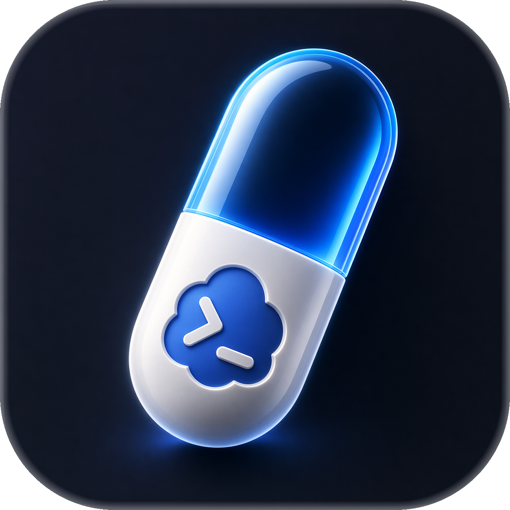
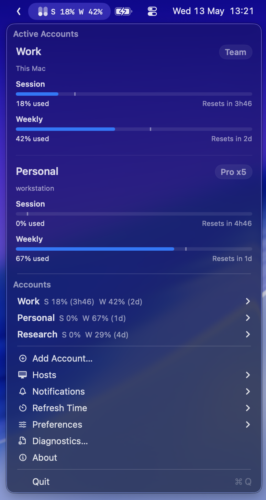

<p align="center">
  
</p>

<h1 align="center">CodexPill</h1>

<p align="center">
  <i>A native macOS menubar companion for Codex accounts, limits, and remote hosts.</i>
</p>

---

CodexPill keeps your Codex account state visible without pulling you out of
flow. It shows your current session and weekly limits, lets you switch saved
local accounts, and can use selected accounts on remote hosts you configure.

It is local-first: CodexPill works with Codex state on your Mac and with remote
hosts that you explicitly configure. It is not a cloud sync service.

<p align="center">
  
</p>

## What It Does

- Shows Codex session and weekly usage from the macOS menu bar.
- Saves local Codex accounts so you can switch between them.
- Adds accounts through an isolated sign-in flow without switching immediately.
- Uses saved accounts on configured SSH hosts.
- Keeps account snapshots local unless you explicitly copy one to a host.

## Install

Signed beta downloads are not available yet. Build from source for now.

When the first public beta is published, download the latest signed beta zip
from GitHub Releases. The release zip will contain `CodexPill.app`; unzip it,
move the app to `Applications`, and launch it.

CodexPill does not currently provide a Homebrew cask, Sparkle updates, Mac App
Store distribution, or unsigned public beta builds.

## Build From Source

Prerequisites:

- macOS with Xcode command line tools installed.
- Tuist installed locally.
- Codex installed and signed in on this Mac.

Build and run:

```bash
tuist generate --no-open
make build
./scripts/run_menubar.sh
```

For release maintainers, the signed public beta artifact is produced with:

```bash
make package-release
```

That command requires local Developer ID signing and notarization setup before
it creates a public release artifact. See [Development](docs/DEVELOPMENT.md)
for maintainer packaging details.

## First Run

Codex must already be installed. CodexPill reads the active local Codex auth
state from `~/.codex/auth.json`, stores saved account snapshots locally under
`~/Library/Application Support/CodexPill`, and switches accounts by updating
local Codex auth state.

Saved snapshots contain authentication material and should be treated like
credentials. CodexPill copies selected snapshots only to remote hosts that you
configure.

CodexPill does not require browser cookies, hidden browser windows, Full Disk
Access, Screen Recording, or Accessibility permissions for normal use.

## Product Docs

- [Product overview](docs/PRODUCT.md)
- [Feature contracts](docs/features/README.md)
- [Privacy and data handling](docs/PRIVACY.md)

## Project Policies

- [MIT license](LICENSE)
- [Security policy](SECURITY.md)
