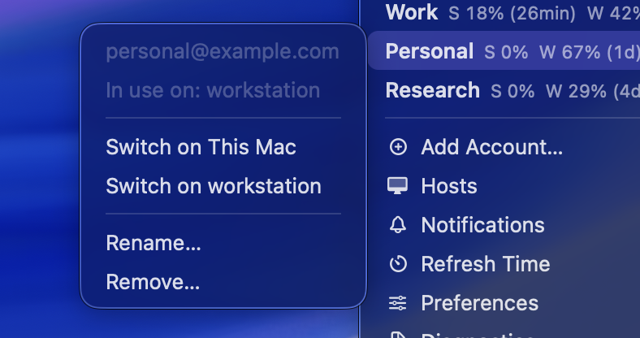
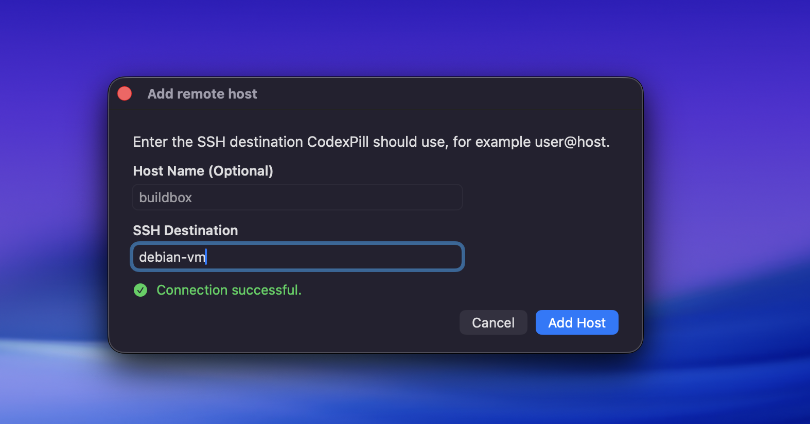
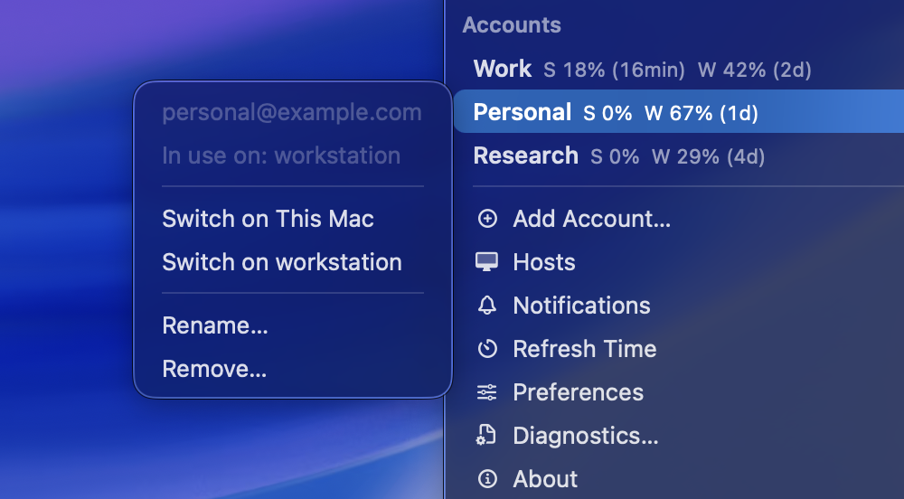
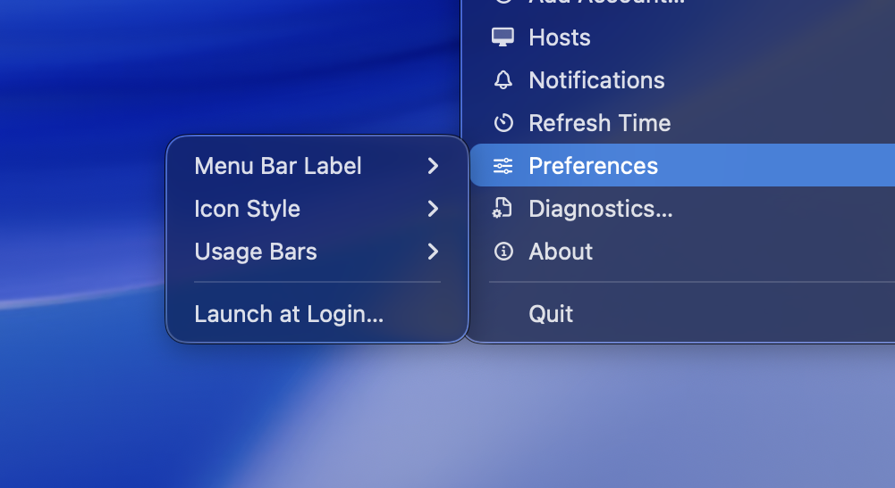

<p align="center">
  
</p>

<h1 align="center">CodexPill</h1>

<p align="center">
  <i>A native macOS menubar companion for Codex accounts, limits and remote hosts.</i>
</p>

<p align="center">
  
  
  
  
</p>

<p align="center">
  
</p>

## What It Does

- Keep Codex session and weekly limits visible from the menu bar.
- Switch between saved local accounts without digging through auth files.
- Add accounts through an isolated sign-in flow that does not switch immediately.
- Use selected saved accounts on SSH hosts you configure.
- Stay local-first: no cloud sync, no hidden browser automation, no account data upload.

## Install

Download the latest signed beta zip from
[GitHub Releases](https://github.com/raphhgg/CodexPill/releases).

The release zip contains `CodexPill.app`; unzip it, move the app to
`Applications` and launch it.

Current beta:

- [CodexPill v0.1.0-beta.1](https://github.com/raphhgg/CodexPill/releases/tag/v0.1.0-beta.1)
- SHA-256: `6c88ccd91a4b9d9929246301eb940e647f1d8573e240b05559e47f7e8f401a41`

CodexPill does not currently provide a Homebrew cask, Sparkle updates, Mac App
Store distribution or unsigned public beta builds.

## Build From Source

Prerequisites:

- macOS with Xcode command line tools installed.
- Tuist installed locally.
- Codex installed and signed in on this Mac.

Build and run:

```bash
tuist generate --no-open
make build
./scripts/run_menubar.sh
```

For release maintainers, the signed public beta artifact is produced with:

```bash
make package-release
```

That command requires local Developer ID signing and notarization setup before
it creates a public release artifact. See [Development](docs/DEVELOPMENT.md)
for maintainer packaging details.

## First Run

Codex must already be installed. CodexPill reads the active local Codex auth
state from `~/.codex/auth.json`, stores saved account snapshots locally under
`~/Library/Application Support/CodexPill` and switches accounts by updating
local Codex auth state.

Saved snapshots contain authentication material and should be treated like
credentials. CodexPill copies selected snapshots only to remote hosts that you
configure.

CodexPill does not require browser cookies, hidden browser windows, Full Disk
Access, Screen Recording or Accessibility permissions for normal use.

## Screenshots

| Add Account | Add Remote Host |
| --- | --- |
|  |  |

| Account Actions | Preferences |
| --- | --- |
|  |  |

## Product Docs

- [Product overview](docs/PRODUCT.md)
- [Feature contracts](docs/features/README.md)
- [Privacy and data handling](docs/PRIVACY.md)

## Project Policies

- [Changelog](CHANGELOG.md)
- [MIT license](LICENSE)
- [Security policy](SECURITY.md)
